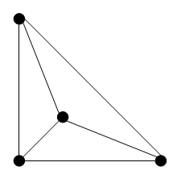
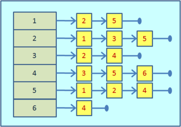
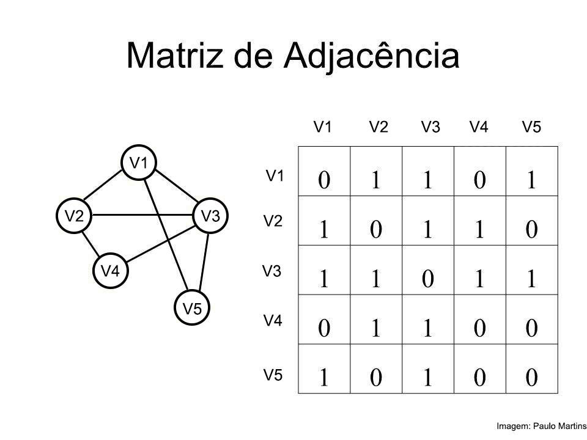
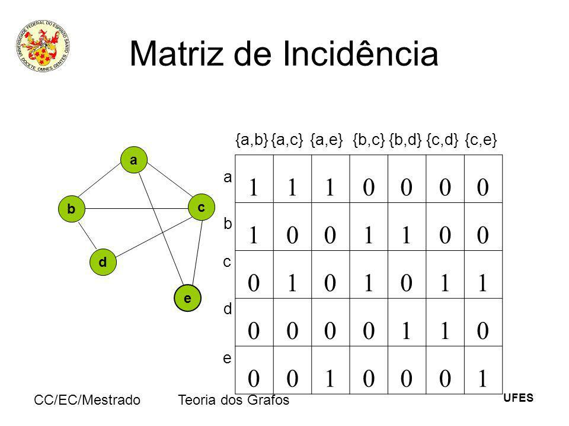

# Grafos

Grafos servem para estudar a relaçao entre ovjetos de um grupo.Os grafos,G(V,E), onde V sao os vertices e E(edges/arestas) é um par ordenado de V.




# Lista de Adjacencia



A lista de adjacencia é a estrutura mais utilizada para representaçao de grafos como estrutura de dados. Ela é considerada uma boa opçao em grafos esparsos e que nao contem arestas multiplas. 
Neste codigo ele esta usando a mesma lista ja implentada no trabalho de AEDS I.

## Inserindo e Removendo

Para inserir nessa lista seria necessario chamar a funçao ***colocarNoUltimo*** presente no *lista.hpp* para colocar uma nova lista no ***adj*** seguido de colocar as suas conecçoes usando a mesma função. Para remover usar a função ***Tirar*** em todas ocorrencias do vertice que voce deseja tirar.

# Matriz de adjacências



Essa estrutura é aplicada para corrigir a desvantagem apresentada pela lista de adjacencia e melhorar uma representaçao de grafos densos

## Inserindo e Removendo

Para inserir um novo vertice o tamanho da matriz teria que ser aumentado em 1 e toda conecçao seria modificada colocando suas cordenadas como por exemplo:
```
    MatrizDeAdj[6][3]=1
```
Num grafo nao orientado alem disso o contrario tambem deve ser feito:
```
    MatrizDeAdj[3][6]=1
```

Para retirar deve igualar todas as ocorrencias desse vertice a zero.

# Matriz de incidências



Nas Matrizes de incidencia ao diferente das matrizes de adjacencia representa os vertices em linhas e as arestas em colunas. É pouco utilizada para a representaçao mas se mostra uma opçao para grafos densos.

## Inserindo e Removendo

Para adicionar um novo vertice de uma matriz de incidencia matrizInc[x][y] seria necessario aumentar o x em 1 e o y no numero de arestas deste vertice. Apos isso com as coordenadas igual na matriz de adjacencia deve se modificar baseada onde o vertice se conecta.